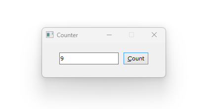
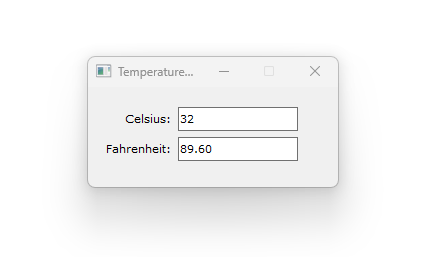
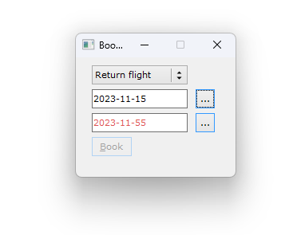
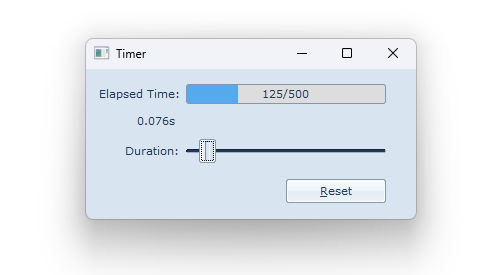
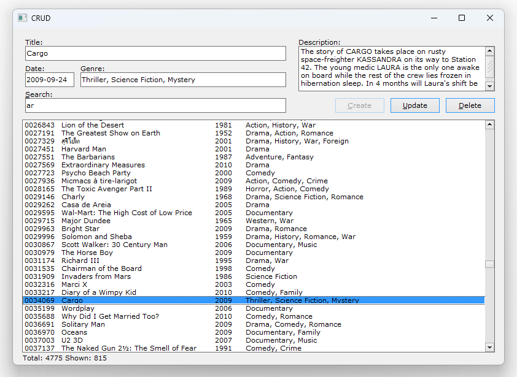
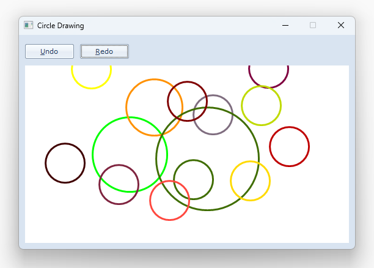
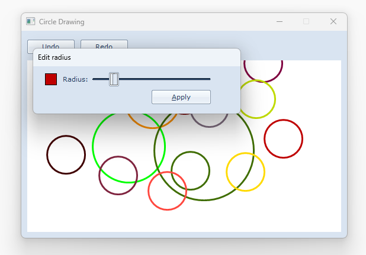
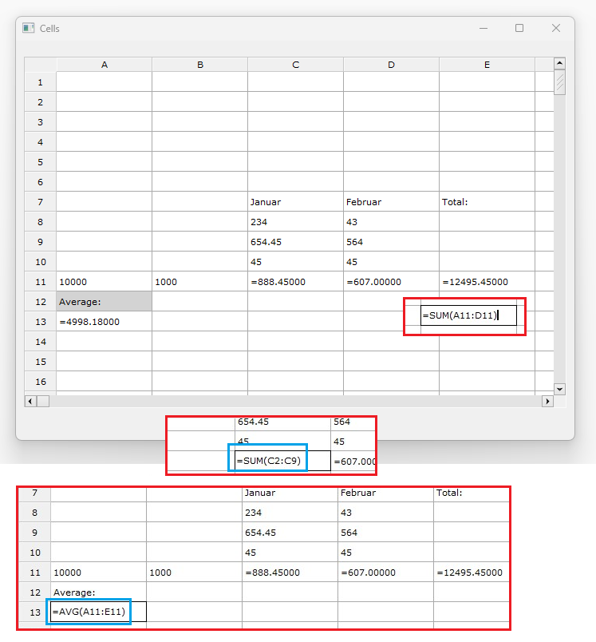

# rust-7gui
[7 GUI](https://eugenkiss.github.io/7guis/tasks/) created on Rust with [FLTK](https://github.com/fltk-rs/fltk-rs) 


### 1. Counter

```
cargo run --bin gui71
```


### 2. Temperature Converter

```
cargo run --bin gui72
```


### 3. Flight Booker

```
cargo run --bin gui73
```


### 4. Timer

```
cargo run --bin gui74
```


### 5. CRUD

```
cargo run --bin gui75
```

SQLite database examples found at:
https://github.com/bbrumm/databasestar/tree/main/sample_databases

Collected in simple database movies_table.db with:
```
SELECT m.movie_id, m.title, m.overview, m.release_date, group_concat(g.genre_name, ', ') AS genres
FROM movie m
INNER JOIN movie_genres mg ON mg.movie_id = m.movie_id
INNER JOIN genre g ON g.genre_id = mg.genre_id
GROUP BY m.movie_id
```


### 6. Circle Drawer

```
cargo run --bin gui76
```
Click to draw a circle, right click to edit radius 




### 7. Cells

```
cargo run --bin gui77
```
Entering data and calculating formulas in the cells. Formulas can be: SUM, AVG, PROD. 
Example: ```=SUM(B1:C3)``` -> calculates sum of values in range B1, B2, B3, C1, C2, C3. 

If some calculated values are in range, they will also be taken in some other calculations, like in screenshot example. 



